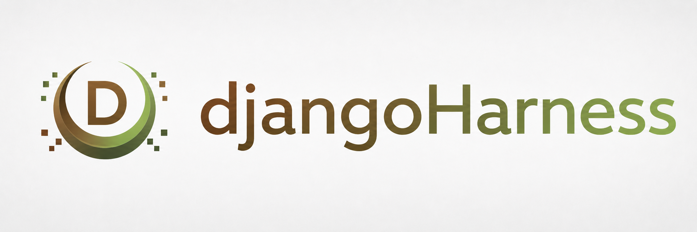

<p align="center">
  
</p>

<p align="center"><strong>__PRODUCT_SUBTITLE__</strong></p>

# __PRODUCT_NAME__

__PRODUCT_NAME__ 基于 DjangoHarness 工程规范构建，由 __AUTHOR_NAME__ 维护。

## 快速开始

环境要求：Python 3.10～3.13、uv。本地默认使用 SQLite，生产环境支持 MySQL
和 Redis。

```bash
uv python install 3.10
uv python pin 3.10
uv sync --all-groups --locked
cp .env.example .env
uv run python manage.py migrate
uv run python manage.py createsuperuser
uv run python manage.py runserver
```

访问主页 <http://127.0.0.1:8000/>，管理后台位于
<http://127.0.0.1:8000/admin/>。

## 开发与验证

```bash
make format
make lint
make test
make check
make docs-build
make deploy-check
```

项目保留 `agent-docs/` 和 `skill/` 中的 DjangoHarness 工程规范。产品 Logo、横幅、
作者二维码和群二维码是占位资源，请在发布前替换。

Cookiecutter 使用及重新生成说明见
[`docs/cookiecutter/README.md`](docs/cookiecutter/README.md)。
生产部署说明见 [`docs/deploy.md`](docs/deploy.md)。

## License

本项目使用 [MIT License](LICENSE)。
